# As Served

**A table that shows your meal at real size before you order — point, hold three seconds,
and a robot arm brings the matching utensil.**

Built for the Seeed Studio *Make a Sign — Interactive Signage Contest 2026*.

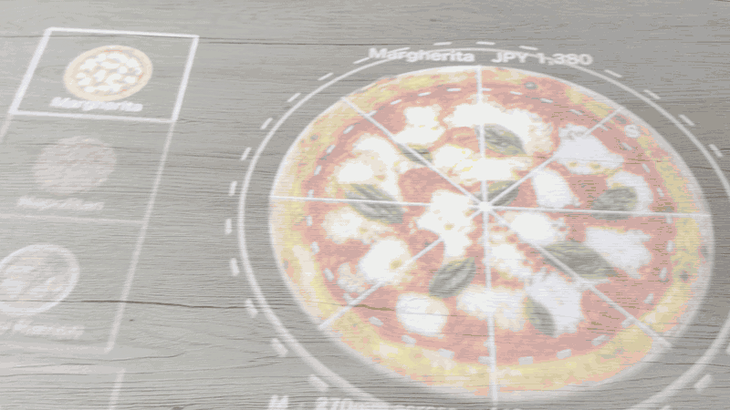

> 日本語の詳細な手順書は **[docs/README.ja.md](docs/README.ja.md)** にあります。

---

## The problem is a missing dimension

Every restaurant menu has the same hole in it. The photo tells you what the dish looks
like. It does not tell you **how much of it** there is.

So we guess. We over-order and leave food behind, or we under-order and wait again. For
the restaurant, leftovers are stock that was bought, cooked, and thrown away. For a
tourist reading a language they don't speak, the portion size is the one thing a photo
can never explain.

Retouching the photo doesn't fix it, because the missing information isn't visual
quality — it's **size**. So this sign puts the dish on your table at its real size,
before you order.

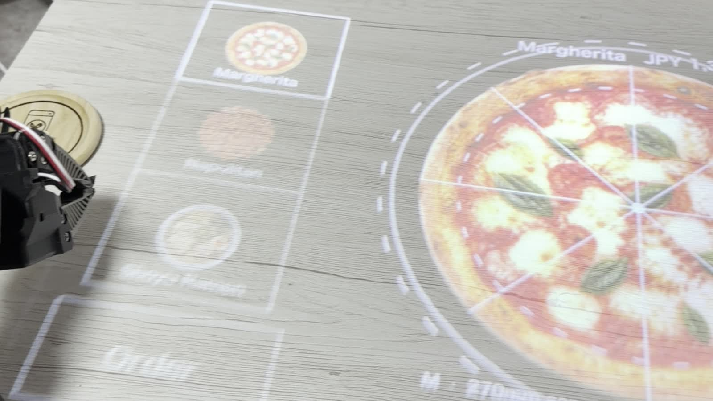

*The dish is not an icon on a screen. It is a 320 mm pizza drawn at 320 mm.*

---

## What it does

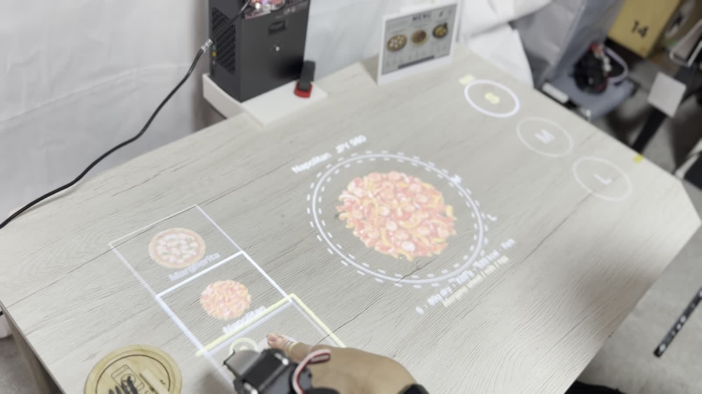

An ultra short throw projector paints the menu directly onto the table. You pick a dish
and a size by **pointing at the table and holding for three seconds** — no touchscreen,
no app, nothing on the table for a guest to touch.

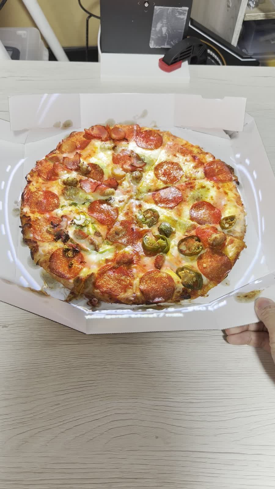

*The same pizza, projected and real. The outline lands on the crust.*

Sizes get the strongest treatment, because they are the point: the size you pick is drawn
solid, and the ones you skipped stay as dashed outlines **on top of** the food. You are
not comparing two numbers, you are comparing two circles at real scale.

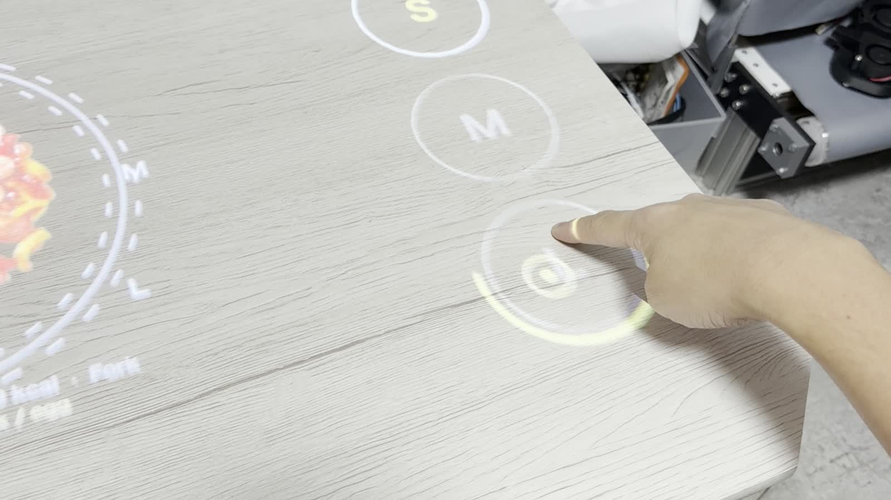

Hold on **Order** and the whole table turns amber. Then a **SO-101 robot arm picks up the
utensil that matches the dish** and puts it down in front of you — chopsticks for ramen,
a fork for pasta. The order card is shown on a **reTerminal E1002** e-paper display beside
the table.

| | | |
|---|---|---|
| 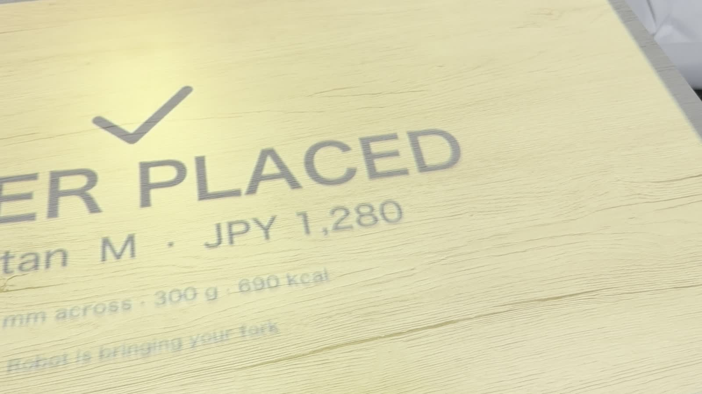 | 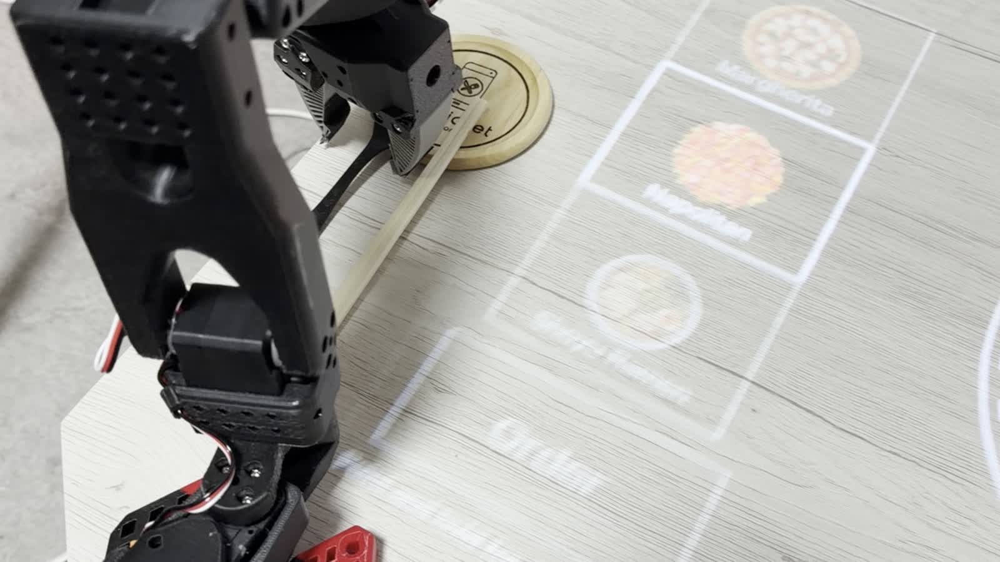 | 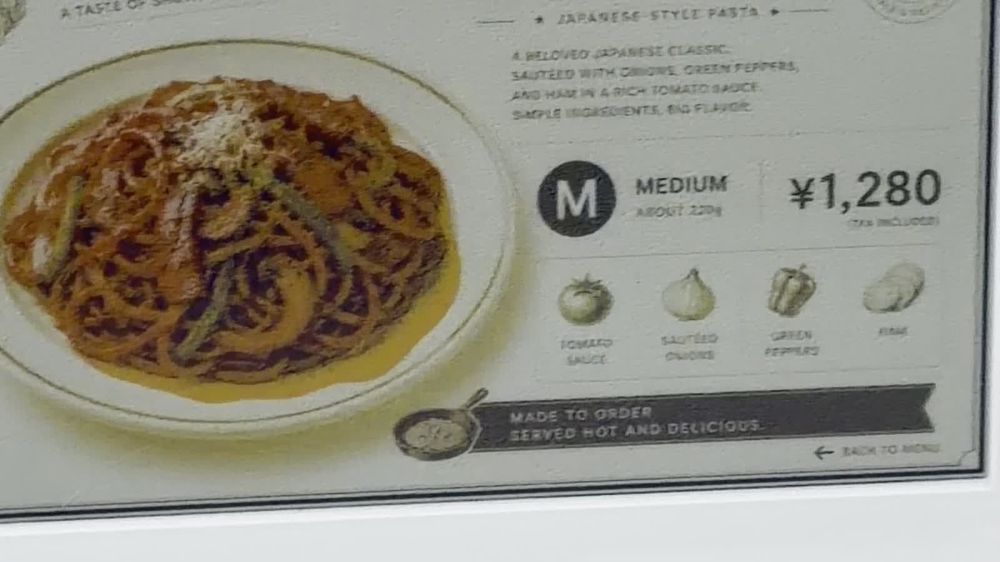 |

---

## How it works

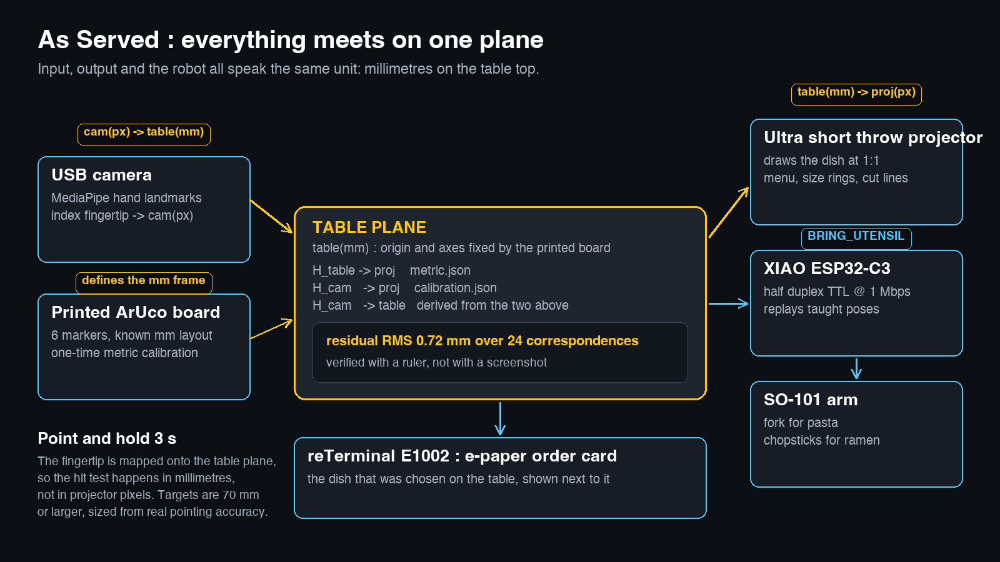

### Everything is drawn in millimetres

The finger, the projection, the plate and the robot's target all live on **the same flat
plane** — the table top. Any two views of the same plane are related by a single 3×3
homography, so the code keeps three frames and three matrices:

| Frame | What it is | Source |
|---|---|---|
| `cam(px)` | camera image pixels | — |
| `proj(px)` | projector framebuffer pixels | — |
| `table(mm)` | millimetres on the table | printed board fixes origin and axes |

`H_cam→proj` comes from a four-corner click calibration, `H_table→proj` from the printed
board, and `H_cam→table` is derived from those two. Every drawing call takes millimetres;
pixels only exist inside `src/render.py`. If the code falls back to pixels halfway
through, "life size" stops being something you can defend.

There is no single "1 mm = N px" scale either — the table is lit at an angle, so the scale
changes across the surface. Every point goes through the homography.

### Calibration you can check with a ruler

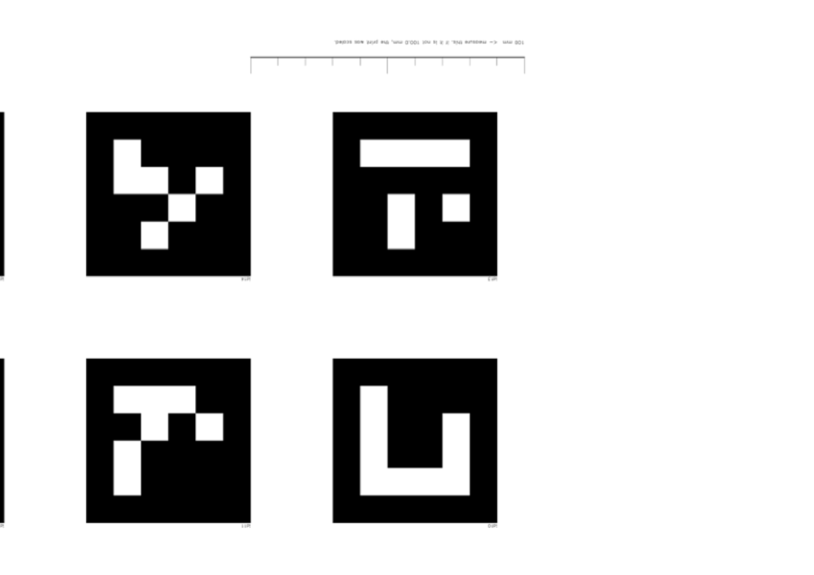

`src/make_board.py` produces an ArUco board with markers at known millimetre spacing, laid
out on an A4 page **as a PDF** — a PDF carries absolute page dimensions, while a PNG
printed from a viewer that assumes 72 dpi comes out 4.2× too large. The page also carries
a printed 100 mm bar so you can confirm the print wasn't silently scaled.

Calibration reports its **residual in millimetres**, not in pixels:

```
residual RMS = 0.72 mm   (24 correspondences, 6 markers)
```

Then `--verify` projects a 100 mm scale bar, a 100 mm grid and a 220 mm circle, so you can
put a real ruler and a real plate on the table and check. A claim of "life size" that can
only be verified from a screenshot isn't a claim at all.

### Point and hold

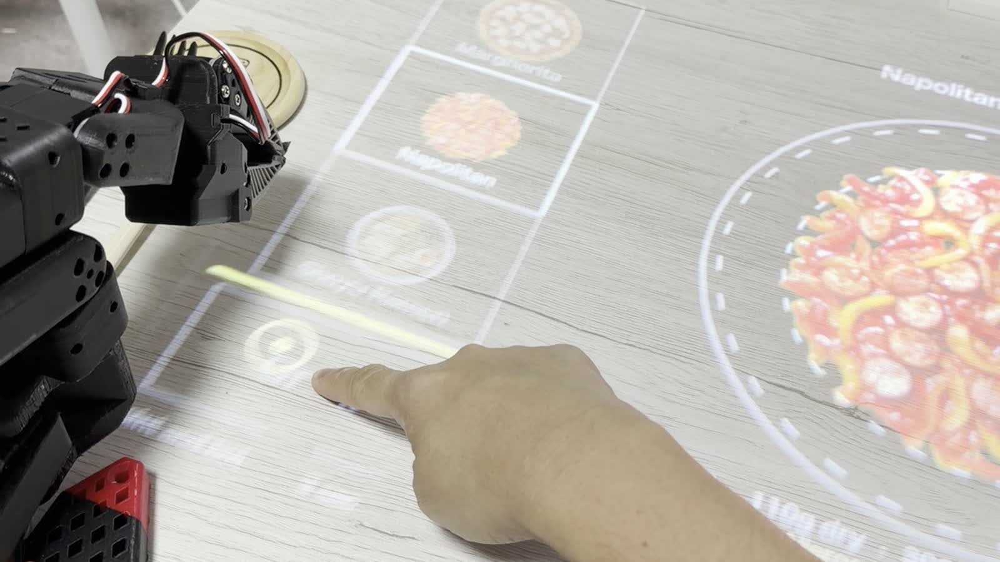

A USB camera runs MediaPipe hand landmarks; the index fingertip is mapped through
`H_cam→table` onto the table plane, and the hit test happens in millimetres.

The honest limitation: a homography assumes the point is **on** the plane. A finger
hovering 50 mm above the table lands tens of millimetres from where it looks like it is
pointing. Three things deal with that:

1. The interaction is designed around **touching** the table, where parallax is zero.
2. Targets are never smaller than **70 mm** (`ui.MIN_TARGET_MM`), sized from real
   pointing accuracy.
3. A reticle is projected at the position the system thinks your finger is, and people
   correct themselves instantly. Closing the loop through the human beats adding a depth
   camera.

Dwell selection has two details that matter in practice. MediaPipe drops frames when the
hand moves fast, so a short grace window keeps the progress instead of throwing it away.
And once a target fires it latches until the finger leaves, so a resting hand doesn't
re-order every three seconds.

### The arm knows nothing about vision

Each dish in `menu.json` declares the utensil it needs. When an order lands, the host
sends one line over USB serial:

```
BRING_UTENSIL <dish_id> <fork|chopsticks>
```

A **Seeed Studio XIAO ESP32-C3**, wired through the **XIAO Bus Servo Adapter**, drives the
SO-101's Feetech STS3215 bus over half-duplex TTL at 1 Mbps. No inverse kinematics run at
showtime: the rack positions and the delivery point were measured once, solved offline
against the official SO-101 URDF with PlaCo, and burned into the firmware as a pose table.
Showtime is pure playback.

That is deliberate. Vision-based grasping demos beautifully and fails in front of an
audience. The utensils sit in a fixed rack and the destination is fixed, so replaying
taught poses is both simpler and the thing that actually works on the day.

The protocol is line-oriented text (`PING` / `STATUS` / `TORQUE_OFF` / `STOP` / …) so the
whole arm can be driven from a serial monitor while debugging. The firmware boots with
torque **off**, refuses to move while the pose table is unconfigured, and honours `STOP`
mid-trajectory.

---

## Getting started

Python is managed with **uv**.

```bash
uv venv --python 3.12 .venv
uv pip install -r requirements.txt
uv run python src/fetch_model.py     # MediaPipe hand model, ~7.5 MB, not vendored
```

### Calibrate (once per setup)

```bash
uv run python src/list_displays.py --test        # which display is the projector
uv run python src/calibrate.py                   # camera -> projector, click 4 corners
uv run python src/make_board.py                  # print the PDF at actual size
uv run python src/calibrate_metric.py            # mm -> projector
uv run python src/calibrate_metric.py --verify   # put a ruler on the table
```

Print the **PDF**, at 100 % with "fit to page" turned off, and measure the 100 mm bar on
the page before trusting anything. Place the board where the food will be — accuracy
degrades as you extrapolate away from it.

### Run

```bash
uv run python src/table_sign.py --pointer hand --arm serial --arm-port /dev/cu.usbmodemXXXX
uv run python src/table_sign.py --pointer hand --arm mock     # no arm attached
uv run python src/table_sign.py                               # keyboard only
uv run python src/table_sign.py --check                       # inspect config without hardware
uv run python src/table_sign.py --preview out.png             # render one frame to a file
```

| Key | Action |
|---|---|
| `←` `→` | dish |
| `↑` `↓` / `1` `2` `3` | size |
| `s` | slices (pizza) |
| `ENTER` | order |
| `c` `r` `g` | compare rings / 100 mm bar / allergens |
| `e` | English / 日本語 |
| `d` | debug HUD |

### Adding a dish

Edit `menu.json`. The image width **is** the dish diameter in millimetres, so crop the
background to zero padding — a few percent of stray margin quietly shrinks every
projection:

```bash
uv run python src/prepare_dish_image.py assets/dishes/_raw/x.png -o assets/dishes/x.png
```

### Tests

109 tests run with no hardware attached, including a synthetic end-to-end check that
renders a calibration board, warps it as if seen by a camera, solves the metric
calibration and verifies that 100 mm comes back as 100 mm.

```bash
uv run pytest tests -q
```

---

## Layout

```
src/            projection app (geometry, renderer, menu, pointing UI, calibration)
arm/            XIAO firmware, offline IK, pose teaching, host-side client
docs/           measurement notes, plan, Japanese setup guide
hackster/       article, images, elevator pitch
tests/          hardware-free test suite
```

Two tiers on purpose: **the projection side runs on its own**. `src/table_sign.py`
requires neither the arm nor the camera at runtime, so a restaurant — or anyone rebuilding
this — can start with the projector alone and add the arm later.

## Hardware

- Ultra short throw projector, USB web camera
- Seeed Studio **XIAO ESP32-C3** + **XIAO Bus Servo Adapter**
- Seeed Studio **reTerminal E1002** (e-paper order card)
- SO-101 arm (6× Feetech STS3215), 3D printed utensil rack
- Printed ArUco calibration board (A4)

## Credits

The projection pipeline (ArUco tracking, four-corner homography calibration, pygame
fullscreen output) started in a separate project and gained the millimetre coordinate
system and metric calibration here.
