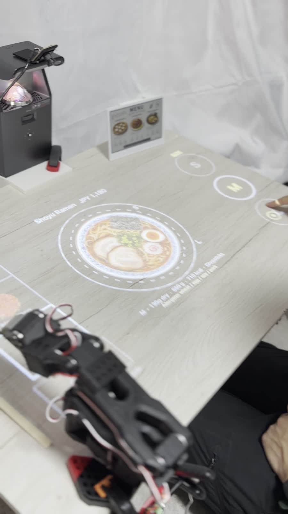
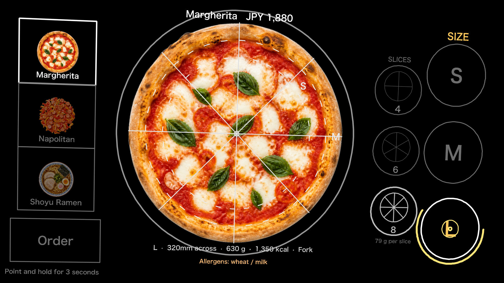
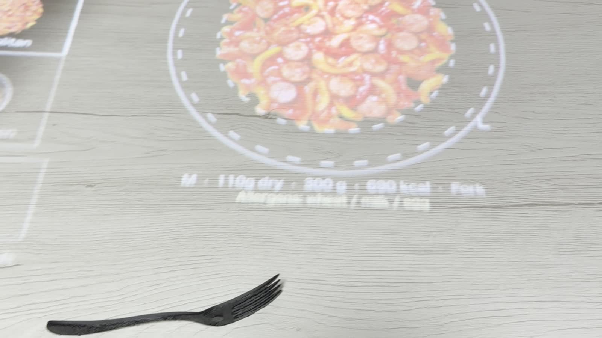

# As Served — a table that shows your meal at its real size, then hands you the right utensil

> **Cover image:** `images/00_thumbnail.gif`
>
> **Elevator pitch (use this one):**
> A table that shows your meal at real size before you order — point, hold three seconds,
> and a robot arm brings the matching utensil.

---

## The problem is a missing dimension

Every restaurant menu has the same hole in it. The photo tells you what the dish looks
like. It does not tell you **how much of it** there is.

So we guess. We over-order and leave food behind, or we under-order and wait again.
For the restaurant, leftovers are stock that was bought, cooked, and thrown away. For a
tourist reading a language they don't speak, the portion size is the one thing a photo
can never explain.

Retouching the photo doesn't fix it, because the missing information isn't visual
quality — it's **size**. So I built a sign that puts the dish on your table at its real
size, before you order.


*The dish is not an icon on a screen. It is a 320 mm pizza drawn at 320 mm.*

---

## What it does


*Projector, camera, arm and an e-paper card. Nothing on the table itself.*

An ultra short throw projector paints the menu directly onto the table. You pick a dish
and a size by **pointing at the table and holding for three seconds** — no touchscreen,
no app, nothing on the table for a guest to touch.


*The same pizza, projected and real. The outline lands on the crust.*

It is not a pizza demo. Pasta and ramen sit in the same menu, each with its own plate
diameter and serving weight.



Sizes are the point of the whole thing, so they get the strongest treatment: the size you
pick is drawn solid, and the ones you skipped stay as dashed outlines **on top of** the
food. You are not comparing two numbers, you are comparing two circles at real scale.



*Dish tiles on the left, size on the right, slice count inboard of it. Everything is laid
out in millimetres and adapts to whatever area the projector actually covers.*

Hold on **Order** and the whole table turns amber.


Then the part people don't expect: a **SO-101 robot arm picks up the utensil that matches
the dish** and puts it down in front of you. Chopsticks for ramen, a fork for pasta.




The order card itself is shown on a **Seeed Studio reTerminal E1002** e-paper display
standing next to the table, so the choice made in light also exists as something the
kitchen and the guest can read.


---

## How it works


### Everything is drawn in millimetres

The whole system rests on one observation: the finger, the projection, the plate and the
robot's target all live on **the same flat plane** — the table top. Any two views of the
same plane are related by a single 3×3 homography, so I keep three frames and three
matrices:

| Frame | What it is |
|---|---|
| `cam(px)` | camera image pixels |
| `proj(px)` | projector framebuffer pixels |
| `table(mm)` | millimetres on the table, origin fixed by a printed board |

`H_cam→proj` comes from a four-corner click calibration. `H_table→proj` comes from the
printed board. `H_cam→table` is derived from those two. Every drawing call in the app takes
millimetres; pixels only exist inside the renderer. If you let the code fall back to
pixels halfway through, "life size" stops being something you can defend.

There is no single "1 mm = N px" scale, either. The table is lit at an angle, so the
scale changes across the surface. Every point goes through the homography.

### Calibration you can check with a ruler


A generator produces an ArUco board with markers at known millimetre spacing, laid out on
an A4 page **as a PDF** — because a PDF carries absolute page dimensions, while a PNG
printed from a viewer that assumes 72 dpi comes out 4.2× too large. (I found that one the
hard way.) The page also carries a printed 100 mm ruler bar so you can confirm the print
wasn't silently scaled.

Put the board where the food will be, run the calibration, and the tool reports its
**residual in millimetres** — not in pixels:

```
residual RMS = 0.72 mm   (24 correspondences, 6 markers)
```

Then it projects a 100 mm scale bar, a 100 mm grid and a 220 mm circle so you can put a
real ruler and a real plate on the table and check. A claim of "life size" that can only
be verified by looking at a screenshot isn't a claim at all.

### Point and hold


A USB camera runs MediaPipe hand landmarks; the index fingertip is mapped through
`H_cam→table` onto the table plane, and the hit test happens in millimetres.

The honest limitation: a homography assumes the point is **on** the plane. A finger
hovering 50 mm above the table lands tens of millimetres away from where it looks like it
is pointing. Three things deal with that:

1. The interaction is designed around **touching** the table, where the parallax is zero.
2. Targets are never smaller than **70 mm**, sized from real pointing accuracy.
3. The system projects a reticle at the position it thinks your finger is, and people
   correct themselves instantly. Closing the loop through the human beats adding a depth
   camera.

Dwell selection has two details that matter in practice. MediaPipe drops a few frames when
the hand moves fast, so a short grace window keeps the progress instead of throwing it
away — otherwise people who *are* pointing correctly get punished. And once a target
fires, it latches until the finger leaves, so resting your hand doesn't re-order every
three seconds.

### The arm knows nothing about vision

Each dish in `menu.json` declares the utensil it needs. When an order lands, the host sends
one line over USB serial:

```
BRING_UTENSIL <dish_id> <fork|chopsticks>
```

A **Seeed Studio XIAO ESP32-C3** receives it and drives the SO-101's Feetech STS3215 bus
over half-duplex TTL at 1 Mbps. No inverse kinematics run at showtime: the rack positions
and the delivery point were measured once, solved offline against the official SO-101 URDF
with PlaCo, and burned into the firmware as a pose table. Showtime is pure playback.

That is a deliberate choice. Vision-based grasping demos beautifully and fails in front of
an audience. The utensils sit in a fixed rack and the destination is fixed, so replaying
taught poses is both simpler and the thing that actually works on the day.

The protocol is line-oriented text (`PING` / `STATUS` / `TORQUE_OFF` / `STOP` / …) so you
can drive the whole arm from a serial monitor while debugging. The firmware boots with
torque **off**, refuses to move while the pose table is unconfigured, and honours `STOP`
mid-trajectory.

---

## Build notes

The projection side runs on a laptop with Python: OpenCV for the homographies and ArUco,
pygame for the projector window, MediaPipe for the hand, Pillow for text. 109 tests run
with no hardware attached — including a synthetic end-to-end check that renders a
calibration board, warps it as if seen by a camera, solves the metric calibration and
verifies that 100 mm comes back as 100 mm. When the real thing is off, that tells you
immediately whether to suspect the algorithm or the setup.

Calibration is four commands:

```bash
uv run python src/list_displays.py --test        # which display is the projector
uv run python src/calibrate.py                   # camera -> projector, click 4 corners
uv run python src/make_board.py                  # print the board (PDF, actual size)
uv run python src/calibrate_metric.py            # mm -> projector
uv run python src/calibrate_metric.py --verify   # put a ruler on the table
```

Then:

```bash
uv run python src/table_sign.py --pointer hand --arm serial --arm-port /dev/cu.usbmodemXXXX
```

Adding a dish is a `menu.json` entry plus a top-down photo. The image width **is** the
dish diameter in millimetres, so a preparation script crops the background away to zero
padding — a few percent of stray margin would quietly shrink every projection.

---

## What I'd do next

- **Close the loop on waste.** The camera already sees the table. Estimating what is left
  on the plate after the meal turns "we think this reduces waste" into a number.
- **Multiple seats.** One projector covering a whole booth, with the serving spot chosen
  per guest rather than fixed.
- **Kitchen side.** The order card already exists on e-paper; sending it onward is a small
  step.

---

## Things used

**Hardware**
- Ultra short throw projector
- USB web camera
- Seeed Studio **XIAO ESP32-C3**
- Seeed Studio **reTerminal E1002** (e-paper order card)
- SO-101 robot arm (6× Feetech STS3215)
- Seeed Studio XIAO bus servo adapter
- 3D printed utensil rack, one fork, one pair of chopsticks
- Printed ArUco calibration board (A4)

**Software**
- Python 3.12, OpenCV, MediaPipe, pygame, Pillow, NumPy
- PlaCo + SO-101 official URDF (offline IK)
- PlatformIO / Arduino (XIAO firmware), FTServo library

---

*Built for the Seeed Studio "Make a Sign — Interactive Signage Contest 2026".*
